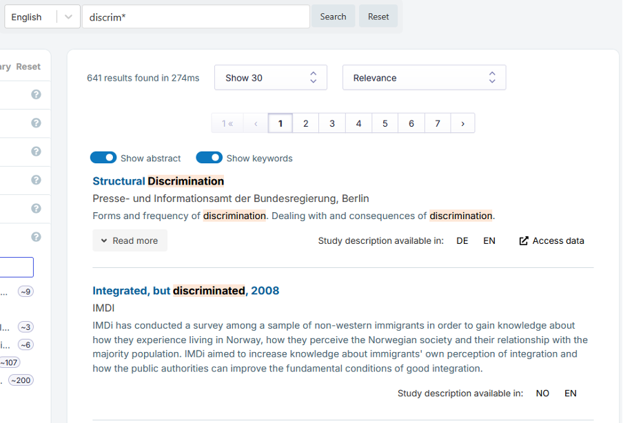

# {{ page.title }}

Basic keyword search is provided in the search bar at the top of the page.

Elasticsearch applies autocompletion in the search.
For example, a search for `discrimin` will give results like "discrimination", "discriminations", "discriminatory".
To ensure comprehensive results, you can use an asterisk (*) after the search term,
e.g. `discrim*`.
Search terms are bolded in the results list.
Clicking on ‘Read more’ in the list allows you to access the full abstract for a particular study.

If you input two or more search terms, for example, entering `equality pay` into the search box,
the default logic between the terms is AND.
This means that datasets where both "equality" and "pay" appear in the documentation are shown on
top of the result list.

The number of results is presented in the upper middle, below the search bar, followed by the search results.
Search terms are bolded in the results list if they occur in the title or abstract. There is no bolding in the detailed study view.
Clicking on ‘Read more’ in the list opens the full abstract for the study.
Results can be sorted by relevance, title (A-Z or Z-A), the date of data collection (oldest or newest) or the publication date of
the dataset description (newest). Note: if the study metadata does not contain the collection or publication date in a standardised format,
these studies come up last and are not sorted by date. Users can also change the number of results displayed on a page.
The search language options are provided in a dropdown menu next to the search box. If you want to browse study descriptions in German,
for instance, choose German as the language. Note: some service providers provide study descriptions only in English, regardless of country,
or both in English and in the local language. Therefore, it is always a good idea to do a search in English as well as in the local language.

The 'Clear search' button clears only the text in the search box.
It does not clear any existing filters applied in the left column,
see [Filtered Search]().
