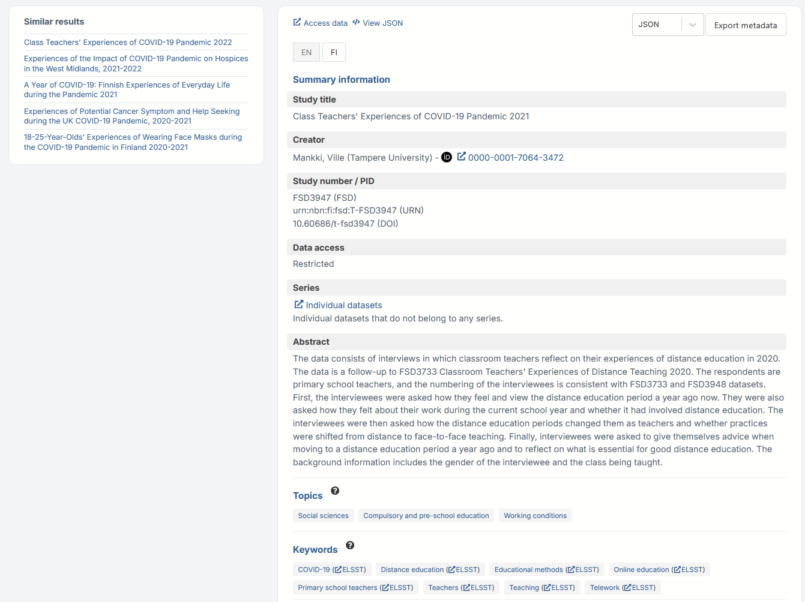
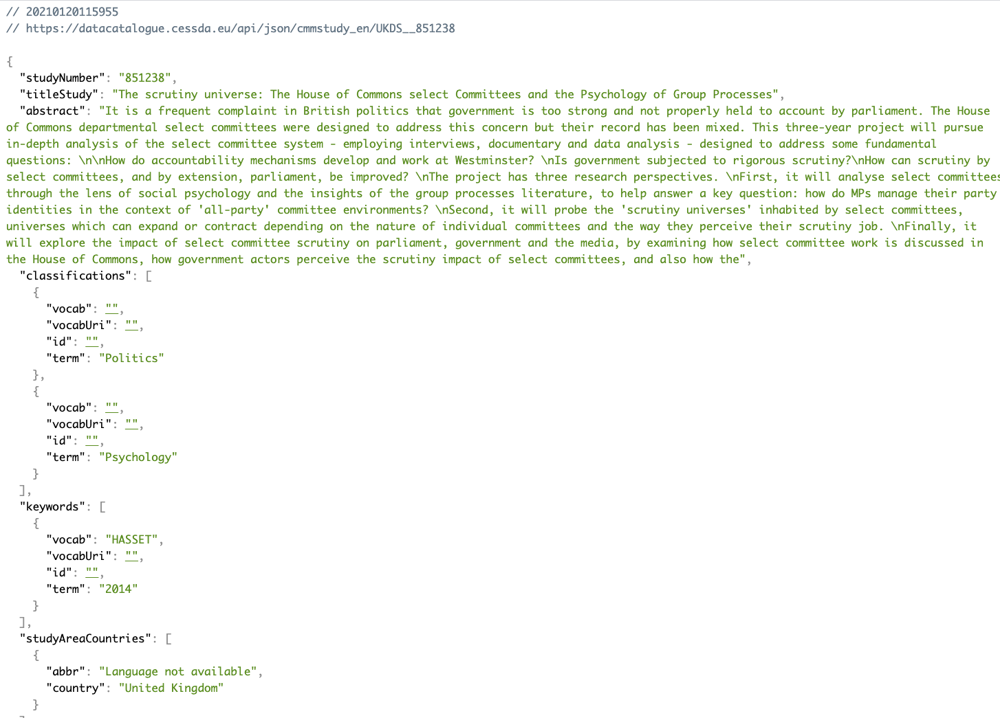

# {{ page.title }}

Clicking on a study title (highlighted in blue) within the results list will take you to the detailed study view,
with more detailed information about the study.
This information includes creators of the data, abstract, methodology, topics and keywords,
and the persistent identifier to be used when citing the data.
Additionally, you will find a link to the study on the Publisher’s website where information on access to
the actual data files can be found.
If the Publisher’s website shows that the data are available with one of the CC-BY licences,
further information on those licences can be found at
[About CC Licences](https://creativecommons.org/about/cclicenses/).

Many organisations providing metadata to the data catalogue use the
same controlled vocabularies to describe the methodology used for the studies.
The infotips (highlighted here with a red circle in the image below)
contain the names and links to these vocabularies.

Below the abstract section, you will find topics and keywords.
If you see a topic relevant to you (e.g. “General health and well-being”), you can click on it.
This will initiate a search using this topic in the topic filter.
If you see a keyword that is relevant to you (e.g. “Health status”) you can click the keyword to initiate a search using this keyword
in the keyword filter. Or you can click on “ELSST” to view the keyword in the European Language Social Science Thesaurus to read more
information about the keyword and find related keywords.

The ‘Access data’ button, found on top of the detailed study view page, brings you to the study description page on
the metadata publisher’s website.
Here you will find information on access to the data files.
This is also a way to find the different national publisher’s catalogues which may provide more search opportunities,
including variable-level searches.

## View JSON

You can view the study description in JSON format, by clicking on 'View JSON'.
The appearance of the JSON content may vary based on the browser you are using.
Currently only Firefox displays JSON in structured format by default.
For other browsers, you need to install a JSON formatter extension to avoid seeing unformatted JSON.

This is the JSON view in Safari, without a JSON formatting extension.

This is the JSON view in Safari, with a JSON formatting extension.

## Installing a JSON formatting extension

For Chrome, see the [Install and manage extensions](https://support.google.com/chrome_webstore/answer/2664769)
help page. 'JSON Viewer' is one of the available extensions for Chrome.

For Safari, see the [How to install Safari extensions on your Mac](https://support.apple.com/en-us/HT203051)
help page. 'SimplyJSON' is one of the available extensions for Safari.
