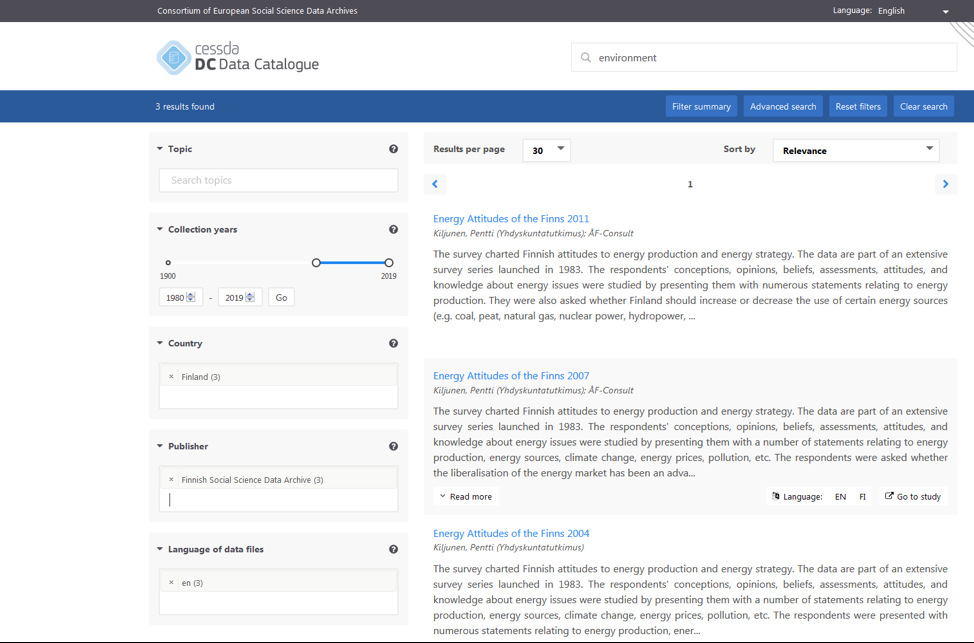

# Filtered Search

There are five filters in the left margin available to refine search results: topic, collection years, country, publisher, and language.
These can be used with or without terms in the Search box.
Clicking in each box produces a list of available choices, and more information about the filter can be found by using the question mark.
For example, “Country” refers to the country where the study took place.

## Example

A search on 1980-2019, for data about Finland, held at the Finnish Social Science Data Archive, in English,
and with the keyword “environment”, returns three data collections.

A button for “Filter summary” appears if filters are being applied.
This opens a new window, enabling easy removal of any existing filters.

The “Reset filters” button clears all the filters in the left column applied to the current search.
It does not clear the text search.

