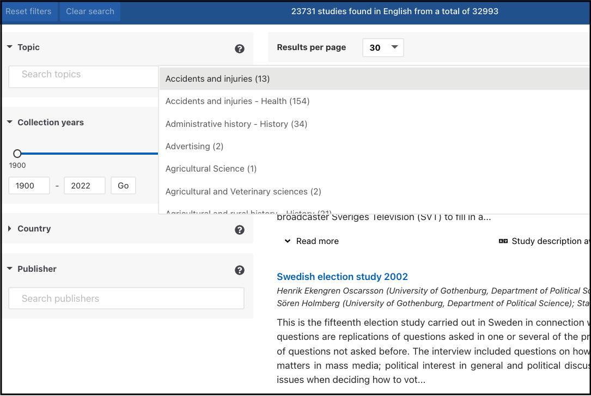
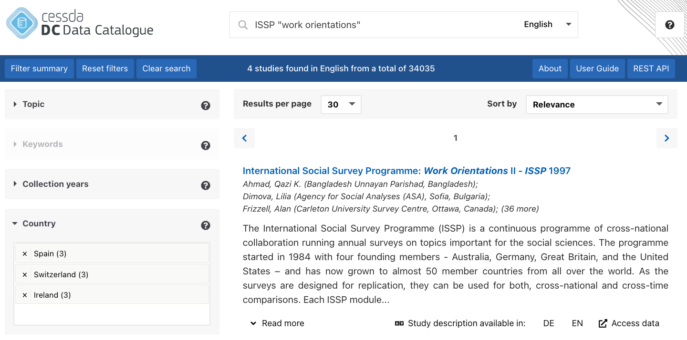

# {{ page.title }}

The system allows filtering by topic, keyword, data collection year,
country in which the study took place, and the institution providing the study metadata.
These institutions are mainly research data repositories.
Note the limitations: the keywords filter includes the 2000 most common keywords whereas the
country and collection years filters include only those studies where the metadata includes
the country and date information in standardised, machine-actionable format.

**Topic** filter: topics identify general topics, subjects or themes of a study.
Many but not all metadata providers used the
[CESSDA Topic Classification](https://vocabularies.cessda.eu/vocabulary/TopicClassification?lang=en)
for their topic terms.
Topics can be selected by scrolling through the drop-down menu or by starting to write into the
search topic bar.

**Keywords** filter: keywords describe the content of the data.
Many but not all metadata providers use
the [ELSST Thesaurus](https://elsst.cessda.eu/) for their keywords.
The searchable list contains a maximum of 2000 of the most common keywords.
As for topics, keywords can be selected by scrolling through the drop-down menu or
by starting to write into the search keywords bar.

**Collection years** filter: The selected collection years are immediately effective when you drag the
years on the line, but if you enter the years into the boxes, you need to use the ‘Go’ button.
Clicking on the ‘Go’ resets the line to the original position, thus removing any selections you have made there.

**Country** filter: The country filter is the country which the data cover.
The filter only includes those studies where the metadata provides an ISO 3166-1 country code.
It is possible to use an additional free-text search with country name for more results.

**Publisher** filter: If you want data only from a particular data repository or repositories,
use the Publisher filter. If you want to exclude a Publisher, select all other publishers except
the one(s) you want to exclude.
Another way is to use the NOT operation (see [Advanced Search]()).

Using filters **increases the precision** of the search.
Let’s imagine you are looking for data on the travel behaviour and travel  attitudes of Norwegians:

1. Enter the relevant terms into the search box, e.g.: `travel norway`.
   This will give you a lot of results, some which might be relevant,
   as well as some not so relevant results.
1. To get more relevant results, enter into the search box the word `travel`
  and choose Norway from the country filter on the left.
  Now you get results from studies covering Norway as a country which might be more relevant.
  Another way of finding relevant dataset can be using the keywords filter and choosing the
  keyword “Travel” and then choosing Norway from the country filter.
1. If you are interested only in data collected over the last five years, use search 2) and in addition,
  use the collection years filter and select the relevant years.
  This should give you fewer but relevant dataset in your results list.
  This way, using the filter options has increased the precision of your search.

If you wish to find **historical data**, use the Collection years filter.
For example, for data on political issues in the post-war period:

1. Select first 1945-1955 as collection years in the filter and then enter relevant search terms like
  `election political politics` in the search box.
1. Another good option to find such data is to first select the collection years in the filter as in 1)
  and next browse the Topic filter.
  In the topic filter, you will find relevant topics like `Elections`, `Political attitudes and behaviour`, `Politics`,
  `International politics and organisations` etc. which you can then select to be included in your search.
  The system allows you to select more than one topic at a time.
  Now you should have in your results list data related to political life and political issues from 1945-1955.

The easiest way to find cross-national data is to eliminate one-country data by selecting three or more
countries in the Country filter. Let’s imagine you are looking for cross-national International Social
Survey Programme (ISSP) data on work orientations.

1. Choose three or four European countries from the country filter and after this, enter the name of the
   survey (ISSP) and `work orientations` or other relevant search terms into the search box.
   This way you are much more likely to get the cross-national, combined ISSP data rather than ISSP
   survey data from a single country on top of the results.
1. Another option would be to choose the European countries from the country filter,
   then click on the Topic or Keywords filter, select potentially relevant topics or keywords and
   finally enter the survey name to the search box.

When using two or more filters, the default is that they are combined using the AND (+) logic.
This means that all the selected filters are applied in the search. For example,
if you pick specific years using the collection years filter and then select a topic through the topic filter,
only datasets matching both criteria will appear in the results. In other words, the dataset documentation must
include both the chosen years as the data collection period and the selected topic. This way,
both filter requirements are met. On the other hand, within a single filter, the default logic is OR.
Thus, if you select several topics or keywords, the results will include datasets where any of the topics or
keywords are mentioned.

To keep the selected filters active,
use the ‘Back’ button or the arrow on your browser to navigate back to the search page from the detailed study view.
If you click on the data catalogue logo instead, all selections will disappear.

Use the ‘Reset filters’ button to clear your filter selections.
