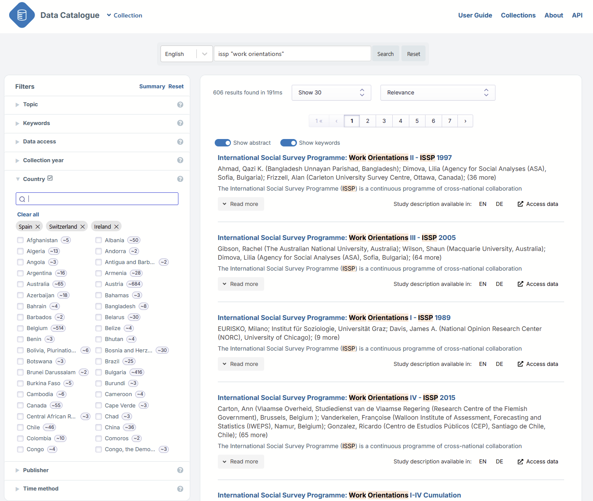

# {{ page.title }}

The system allows filtering by topic, data collection year,
country in which the study took place, and the institution providing the study metadata.
These institutions are mainly research data repositories.
Note the limitations: the Country and Collection years filters include
only those studies where the metadata includes the country
and data information in standardised, machine-actionable format.

Using filters increases the precision of the search.
Try, for example, entering into the search box: *travel norway*.
There are a lot of results. If you enter the word *travel* into the search box
and choose Norway from the Country filter, you get fewer but more relevant results.
If you are interested only in data collected over, for instance, the last five years,
use the Collection years filter.

If you wish to find historical data, use the Collection years filter.
For example, for data on political issues in the post-war period,
first select *1945-1955* as the collection years and enter
e.g. *election political politics* in the search box.
Another good option is to browse the Topic filter **after**
you have first selected the collection years.
There you can choose topics like Elections, Political attitudes and behaviour, Politics,
International politics and organisation, whatever is relevant for you.

The selected collection years are immediately effective when you drag the years on the line,
but if you enter the years into the boxes you need to use the ‘Go’ button.
Clicking on ‘Go’ resets the line to the original position,
thus removing any selections you have made there.

If you want data only from a particular repository or repositories, use the Publisher filter.
If you want to exclude a Publisher, select all other publishers except the one(s) you want to exclude.
Another way is to use the NOT option (see [Advanced Search]()).

To find cross-national data, choose three or more European countries from the Country filter
and enter the relevant search term into the search box (or use the Topic filter).
Tip: choose Countries with a small number after the country name to get less noise in the results.

If you use two or more filters, the default between them is AND (+),
so all have to apply in the results.
The default within a filter is OR, so if you select several countries, for instance,
you will get studies where any of the selected countries is included.

To keep the selected filters active,
use the ‘Back’ button or the arrow on top left to navigate back to the search page.
If you click on the data catalogue logo instead, all selections will disappear.

Use the ‘Reset filters’ button to clear your filter selections.
