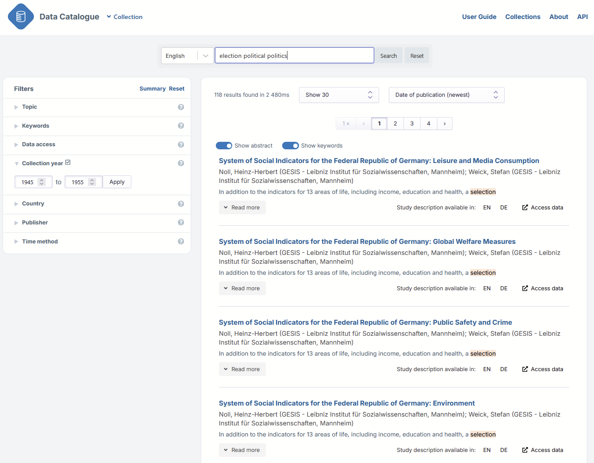

# {{ page.title }}

The system allows filtering by topic, data collection year,
country in which the study took place, and the institution providing the study metadata.
These institutions are mainly research data repositories.
Note the limitations: the Country and Collection years filters include
only those studies where the metadata includes the country
and data information in standardised, machine-actionable format.

Using filters **increases the precision** of the search.
Let’s imagine you are looking for data on the travel behaviour and travel  attitudes of Norwegians:

1. Enter the relevant term into the search box, e.g.: `travel norway`.
  You get a lot of results, some relevant, some not so relevant.
1. To get more relevant results, enter into the search box the word travel and choose Norway from the country filter on the left.
  Now you get fewer but more relevant results.
1. If you are interested only in data collected over the last five years, use search 2) and in addition,
  use the collection years filter and select the relevant years.
  Now you should have still fewer but relevant data in your results list.
  In this way, using the filter has increased the precision of your search.

If you wish to find **historical data**, use the Collection years filter.
For example, for data on political issues in the post-war period:

1. Select first 1945-1955 as collection years in the filter and then enter relevant search terms like
  `election political politics` in the search box.
1. Another good option to find such data is to first select the collection years in the filter as in 1)
  and next browse the Topic filter.
  In the topic filter, you will find relevant topics like `Elections`, `Political attitudes and behaviour`, `Politics`,
  `International politics and organisations` etc. which you can then select to be included in your search.
  The system allows you to select more than one topic at a time.
  Now you should have in your results list data related to political life and political issues from 1945-1955.

The selected collection years are immediately effective when you drag the years on the line,
but if you enter the years into the boxes you need to use the ‘Go’ button.
Clicking on ‘Go’ resets the line to the original position,
thus removing any selections you have made there.

If you want data only from a **particular repository or repositories**, use the Publisher filter.
If you want to exclude a Publisher, select all other publishers except the one(s) you want to exclude.
Another way is to use the NOT option (see [Advanced Search]()).

The easiest way to find cross-national data is to wean out one-country data by selecting three or more countries in the Country filter.
Let’s imagine you are looking for cross-national International Social Survey Programme (ISSP) data on social networks.

1. Choose three or four European countries from the country filter and after this,
  enter the name of the survey and social networks or other relevant search term into the search box.
  This way you are much more likely to get  the cross-national,
  combined ISSP data rather than  ISSP survey data from a particular country on top of the results.
1. Another option would be to choose the European countries from the country filter,
  then click on the Topic filter, select relevant-seeming topics from there for you search
  and finally enter the survey name to the search box.

If you use two or more filters, the default between them is AND (+),
so all have to apply in the results.
This means that if you selected certain years from the collection years filter and then chose a few topics from the topics filter,
the system will include only those datasets in the results list where the documentation has those years as data collection years
and has mentioned that topic in the metadata.
So both filter conditions are fulfilled. The default within a filter is OR, so if you select several topics, for instance,
you will get datasets where  any of the selected topics is mentioned.

To keep the selected filters active,
use the ‘Back’ button or the arrow on top left to navigate back to the search page.
If you click on the data catalogue logo instead, all selections will disappear.

Use the ‘Reset filters’ button to clear your filter selections.
