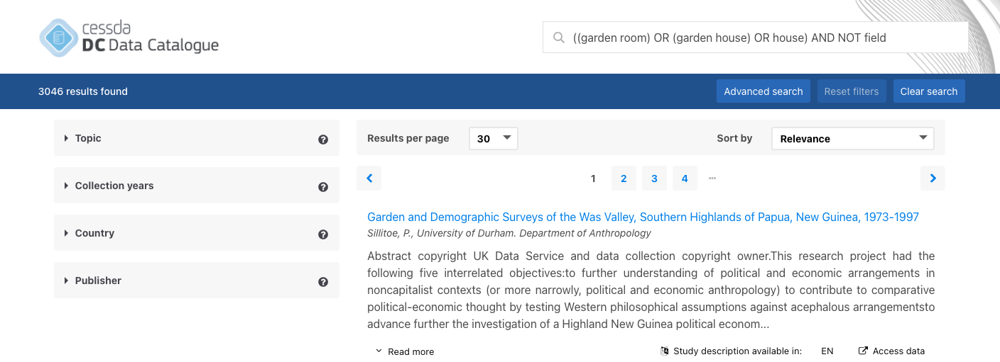

Searching
=========

The primary measn for searching the Data Catalogue is through the search bar at the top.

Reset
-----

The "Reset filters" button only clears all filters in the left column applied to the current search. It does not clear search text.

Clear
-----

The "Clear search" button only clears the search text. It does not reset or clear any existing filters applied in the left column.

Advanced Search
---------------

In order to be able to support advanced users, we are leveraging Elasticsearch's
Simple Query Syntax with these special characters:

- `+` signifies **AND** operation
- `|` signifies **OR** operation
- `-` **negates** a single token
- `"` wraps a number of tokens to signify a **phrase** for searching
- `*` at the end of a term signifies a **prefix** query
- `(` and `)` signify **precedence**
- `~N` after a word signifies edit **distance** (fuzziness)
- `~N` after a phrase signifies **slop** amount

Example
^^^^^^^

The above exmaple search for ``CONCEPTUAL + METHODOL* + -Sleep + -psycho*``
includes all hits for Conceptual, any word starting with methodol,
but not containing Sleep or anything starting with psycho.

Filtering
---------

Several filters can be applied through the menu on the left.

.. image:: images/filters.png

