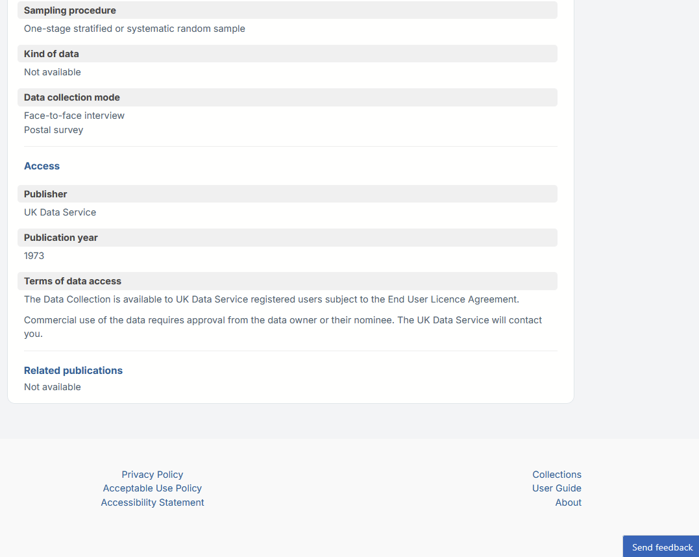
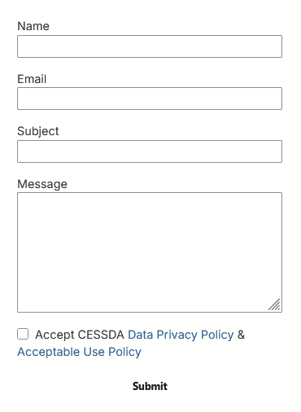

# {{ page.title }}

If you encounter any problems with the service, you can report them by clicking on the ‘Send feedback’
button located at the bottom right.
Just complete the online form to provide your feedback.

Feel free to provide any kind of feedback, insight or suggestions for the Data Catalogue service.
Did you meet any challenges when using the system, what works, what does not work, what can we do better?
Whatever it is you want to say, we will want to hear it.

In the feedback form, please enter your name, email, subject and give a short summary or description of
your issue. Submit your issue by clicking on the ‘Submit’ button and we will get back to you.
